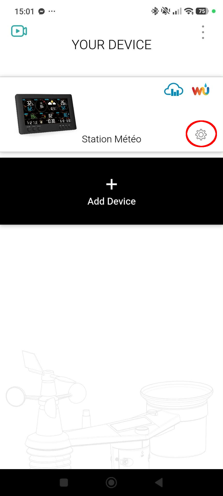
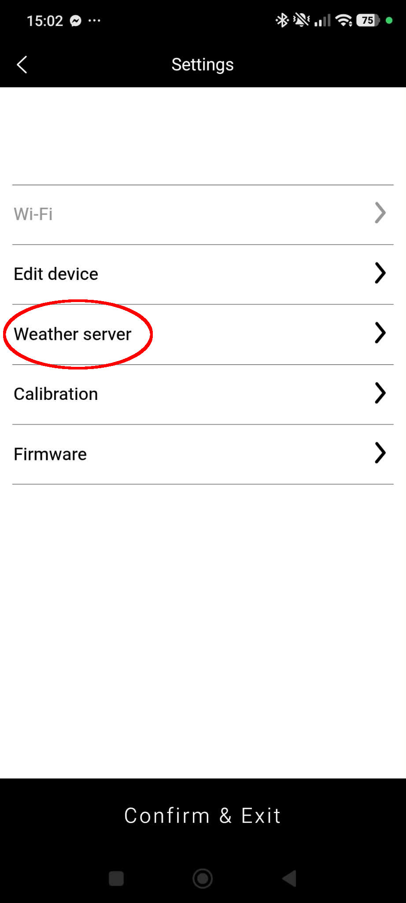
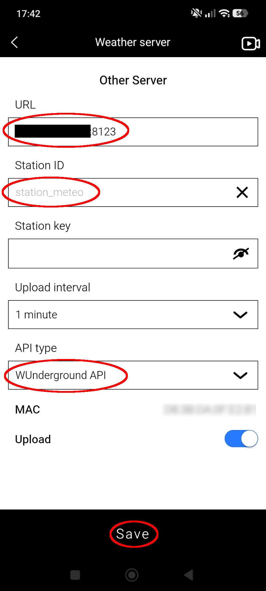

<image src="https://raw.githubusercontent.com/home-assistant/brands/refs/heads/master/custom_integrations/personal_weather_station/icon%402x.png" alt="image" align="right" height="177"></image>

[](https://github.com/hacs/integration) 

[](https://github.com/MaxensF/personal_weather_station/releases)

[](https://my.home-assistant.io/redirect/hacs_repository/?owner=MaxensF&repository=personal_weather_station&category=integration)


# Personal Weather Station (PWS)

This custom Home Assistant integration allows you to receive real-time data from your **Personal Weather Station** and expose it as sensors inside Home Assistant. It uses an HTTP endpoint to receive sensor updates and automatically creates or updates sensors for temperature, humidity, pressure, and more.

---

## Features

- Receive weather station data via HTTP requests, in either the Weather Underground or the WSLink format.
- Automatically create new sensors for any supported data key.
- Update existing sensors in real time.
- Entities and their values survive a Home Assistant restart.
- A station that stops reporting is marked unavailable instead of showing a frozen value.
- Recalibrate true north without touching the hardware.
- Water leak and connection readings are proper binary sensors.
- Misconfigured stations are reported in Repairs instead of failing silently.
- Available in all 64 languages Home Assistant supports (8 reviewed, the rest awaiting proofreading — see [Contributing](CONTRIBUTING.md)).
- Authentication (optional).

---

## Supported Sensors

The integration relies on a predefined list of sensors in [`SENSOR_LIST`](./custom_components/personal_weather_station/const.py), covering both supported protocols. The parameter names differ between them:

| Measurement | Weather Underground | WSLink |
|---|---|---|
| Outdoor temperature | `tempf` (°F) | `t1tem` (°C) |
| Outdoor humidity | `humidity` (%) | `t1hum` (%) |
| Pressure | `baromin` (inHg) | `rbar` / `abar` (hPa) |
| Wind speed | `windspeedmph` (mph) | `t1ws` (m/s) |
| Wind direction | `winddir` (°) | `t1wdir` (°) |
| Daily rain | `dailyrainin` (in) | `t1raindy` (mm) |

Each sensor carries a **name**, **unit of measurement**, **icon**, **device class** and **state class**, so Home Assistant converts and records it correctly.

---

## Compatible Weather Stations

The following personal weather stations have been confirmed to work with this integration:

- **Bresser Weather Stations**
  - 7002586
  - 7002582
  - 7002620 
  - 7003300
  - 7003400
  - 7004406
- **YOUSHIKO Weather Stations**
  - YC9471 

Other stations may also work if they can send HTTP/HTTPS GET requests with query parameters matching the keys defined in `SENSOR_LIST`.  
Feel free to try your own weather station and see if it works, and consider contributing any new compatible models to the project!

### Advanced workaround

Some weather stations do not natively support custom upload URLs. Two workarounds are available:

- **Manual workaround:** Intercept Weather Underground traffic. See the detailed setup instructions in [Intercepting Wunderground traffic (issue #20)](../../issues/20).
- **All-in-one solution:** Use the **WSLink Add-on**, developed by @schizza, which intercepts Weather Underground traffic and forwards the decoded weather data to Home Assistant. See the project [here](https://github.com/schizza/wslink-addon)
> [!NOTE]
> Version **0.0.7** of the add-on broke the upload flow. It was fixed in **0.0.8**
> and the add-on has moved on since, so use a current version — there is no longer
> any reason to run a fork.

---

## Quick Start Guide for Bresser Stations with WSLink App

Install the integration (see below), add it in **Settings → Devices & Services →
Add Integration**, and note the **station key** you set — you will need it in a
moment. The integration then shows you exactly what to enter; the same
instructions stay available from its ⚙️ afterwards.

Your station must already be set up in the WSLink app and running an up-to-date
firmware. Then:

> [!WARNING]
> **Have the values ready before you open the app, and do not linger on these
> screens.** The station tends to drop its WiFi connection if you spend too long
> entering the server settings — and all the more so if you sit in the menu
> waiting for the data to turn up in Home Assistant.
>
> Copy the URL, station ID and key first, fill the form in one go, and press
> **Confirm & Exit** straight away. Watch for the data on the Home Assistant
> side afterwards, not from the app.

### 1. Open your station's settings



### 2. Weather server



### 3. Other Server


Weather Underground and Weathercloud upload to those services. **Other Server**
is the one that lets you point the station at your own Home Assistant.

### 4. Fill in the server



| Field | What to enter |
|---|---|
| **URL** | Your Home Assistant address and port, **without `http://` or `https://`** — for example `192.168.1.100:8123`. Use an address your station can reach **on your own network**; there is no reason to open a port to the internet so a weather station can upload. If your station cannot resolve names, use the IP. |
| **Station ID** | Anything you like. It becomes the device name in Home Assistant. |
| **Station key** | The key you set in the integration. Leave it empty if you left that blank. |
| **Upload interval** | 1 minute is a good default. |
| **API type** | **WUnderground API**. |
| **Upload** | Already enabled by default — leave it on. |

Then press **Save**.

### 5. Confirm & Exit


> [!IMPORTANT]
> **This is the step that actually writes the settings to the station.** Pressing
> *Save* on the previous screen changes nothing on its own. Once you press
> **Confirm & Exit**, Home Assistant receives data within seconds and your
> sensors appear.

> [!NOTE]
> Some Bresser firmwares from **3.02** onwards refuse plain HTTP. Home Assistant
> then has to serve HTTPS on an address your station can reach.

---

## Installation

> [!IMPORTANT]
> Requires **Home Assistant 2025.3.0 or later**.

Upgrading from an earlier release is safe: nothing is renamed or removed on its
own. See the [changelog](CHANGELOG.md) for what changed and for the two optional
migrations offered in Repairs.

### HACS Installation (Recommended)

This integration is available in the default HACS store. You do not need to add a custom repository anymore!

1. Open HACS in Home Assistant
2. Search for **"Personal Weather Station"**
3. Click **Download**, then install the integration
4. Restart Home Assistant
5. Add the integration from **Settings → Devices & Services → Add Integration**


### Manual Installation

1. Navigate to your Home Assistant configuration folder.
2. Create the folder `custom_components/personal_weather_station`.
3. Copy all integration files into this folder (`__init__.py`, `sensor.py`, `manifest.json`, etc.).
4. Restart Home Assistant.
5. Add the integration from  **Settings → Devices & Services → Add Integration**

---

## Weather station configuration

### Manual configuration for any Weather Station supporting the PWS protocol

Set at least these parameters :

- **URL**: ```http://<HOME_ASSISTANT_IP>:8123```
- **ID**: `any identifier (e.g., my_station) — this will become the device ID in Home Assistant
- **Station Key**: a password known only to you.

**Important** : In your weather station configuration, make sure to set the URL to point to your Home Assistant instance

#### HTTP Endpoint

The integration exposes an HTTP endpoint that your weather station can call:

```
http://<home_assistant_ip>:8123/weatherstation/updateweatherstation.php
```

Query parameters format:

```
?ID=<device_id>&PASSWORD=<station_key>&tempf=72&humidity=55
```

- `ID` (or `wsid` on the WSLink endpoint): unique device ID, **required**. A request without it is answered with HTTP 400.
- `PASSWORD` (or `wspw`): the station key. A wrong one is answered with HTTP 401 and raises a repair issue in Home Assistant.
- Other parameters: sensor keys matching `SENSOR_LIST`. Unknown keys are ignored, and a key sent with an empty value simply leaves its sensor unknown.

### Configuration for Weather Stations with WSLink App

Make sure to set these parameters in the WSLink application:

- **URL**: ```http://<HOME_ASSISTANT_IP>:8123``` (for http) or ```<HOME_ASSISTANT_DOMAIN>``` (for https) (depending on weather your Weather Station only supports http or https)
- **Sender ID**: any identifier (e.g., my_station) — this will become the device ID in Home Assistant
- **Station Key**: a password known only to you
- **Upload** Interval: any interval you want, e.g., 60 seconds
- **API Type**: Note that some stations have this field. In that case, make sure to select "WUnderground API" or "WSLink API".

This configuration will allow your Weather Station to send weather data correctly to Home Assistant via the PWS integration. As this integration only allows you to configure one station key, all of your Weather Stations should use the same.

> [!IMPORTANT]  
> Bresser weather stations running firmware version **3.02** or later require SSL.
> With these versions, using HTTP will cause a silent failure, meaning no data will be transmitted.
> Note: There might be versions prior to 3.02 that also require SSL, but 3.02 is the first known version that definitively needs it.
> Home Assistant must therefore be configured with SSL enabled, and the URL configured in WSLink must use https instead of http.

### Config Flow
- Add a new weather station using its station key. Ensure that this key matches the one configured in the weather station settings or leave it blank to accept any station key.
- All setup is done automatically upon HTTP(S) requests.

---

## Usage

1. Your weather station sends HTTP GET requests with sensor data to Home Assistant.
2. The integration checks if the device exists. If not, it creates a new device.
3. Each sensor in the request is either created (if new) or updated (if existing).
4. All sensors appear in Home Assistant under the device `Weather Station <ID>`.

### Example HTTP Request

```text
http://192.168.1.23:8123/weatherstation/updateweatherstation.php?ID=my_station&PASSWORD=<station_key>&tempf=72&humidity=55
```

- Creates/updates the outdoor temperature and outdoor humidity sensors of device `my_station`.

---

## Entity Creation

The integration automatically creates entities based on the parameters received in each HTTP request. 
When a new parameter is sent that does not yet exist as a sensor in Home Assistant, the integration will generate a new entity for it under the device corresponding to the ID of the request.

Multiple requests can be sent sequentially to create new entities. You do not need to include all parameters in a single request. Any new parameter sent in a later request will automatically create its corresponding entity.

Entities have no default values, as they are created only when a value is received from the station.
They always reflect the last received value.

### Example:

HTTP request:
```http://192.168.1.23:8123/weatherstation/updateweatherstation.php?ID=my_station&tempf=72&humidity=55&winddir=180```

Will create the `my_station` device. The following entities will be attached to it:
- `sensor.my_station_outdoor_temperature`
- `sensor.my_station_outdoor_humidity`
- `sensor.my_station_wind_direction`
- `sensor.my_station_last_update` (diagnostic, see below)

Subsequent requests with new parameters (e.g., `rainin=0.1`) will create additional entities automatically without manual configuration.

## Entity Update

When a value is received from the weather station, the integration automatically updates the corresponding entity:

- A whole number becomes an int, a decimal number becomes a float.
- A value that is not a number at all is kept as text.
- An **empty** value becomes `unknown`. Both protocols do send keys with no value when the matching sensor has nothing to report, and the rest of the request is processed normally.

A single unusable parameter never costs you the others: it is logged and skipped, and the response reports how many were skipped.

> [!NOTE]
> This integration does not convert anything itself. Values are stored exactly as received and each key is declared with the unit its protocol uses: **Weather Underground is imperial** (°F, mph, inHg, inches) while **WSLink is metric** (°C, m/s, hPa, mm). Home Assistant then converts to whatever your system is set to, which is why a WSLink wind speed sent in m/s shows up in km/h on a metric system.

---

## Calibrating true north

A weather station has to be oriented when it is installed. If the vane could not
be aligned precisely, every wind direction is off by a fixed amount — and there
is no need to climb back up to fix it.

Once a station has reported a wind direction, three controls appear on its device
page:

| Entity | What it does |
|---|---|
| `number.<station>_wind_direction_offset` | The rotation applied to every direction, 0-359°. Adjust it by hand at any time. |
| `button.<station>_set_north_from_current` | Takes the direction being reported right now as north. |
| `button.<station>_reset_wind_offset` | Drops the calibration. |

**Procedure:** hold the vane pointing at **geographic** north (not magnetic
north — in most of Europe the difference is a few degrees, but check your local
declination), wait for the station to upload, then press *Set north from current*.
The offset appears in the number entity and every direction sensor follows.

A diagnostic sensor `Wind direction (raw)` keeps showing the uncorrected reading,
so you can always check a calibration or redo one.

> [!NOTE]
> The offset applies to values as they arrive. History already recorded is not
> rewritten.

Buttons have no confirmation step in Home Assistant. If you would rather be asked
first, add one in your dashboard:

```yaml
type: button
entity: button.my_station_set_north_from_current
confirmation:
  text: Is the vane pointing north?
```

---

## Knowing whether a station is alive

Because the integration only ever receives data, it has no other way to notice a
station that stopped reporting.

- Every station gets a **`Last update`** diagnostic sensor showing when it last
  posted. It stays readable even when the station is offline, which is exactly
  when you need it.
- After a configurable delay (**Mark as unavailable after**, 15 minutes by
  default, `0` to disable) the station's sensors switch to *unavailable* instead
  of showing a frozen reading forever.

Entities and their last values are restored on restart, so a Home Assistant
reboot no longer leaves a dashboard full of holes until the next upload.

---

## When nothing shows up

This integration has **no "add device" button**, and that is not an oversight:
your weather station creates its own device the first time it posts. Nothing here
can go looking for it.

So the setup flow ends by telling you exactly what to enter in the station — the
address of your Home Assistant instance included, worked out for you. And until a
station has actually posted, a prompt sits in **Settings → System → Repairs** that
brings those instructions back and **waits with you** for the first upload,
reporting what to check if nothing arrives within a few minutes.

That prompt goes away once a station is through, so the same instructions stay
available from the integration itself: **⚙️ → How to point a station at Home
Assistant**. That is where to look when adding a second station later on.

Once a station is misconfigured rather than absent, it looks exactly the same from
here: an empty page. To make the difference visible, rejected requests raise their
own repair:

- **Wrong station key** — the key in the station or in the WSLink app does not
  match the one set here. The repair names the source IP address.
- **No station identifier** — the station posted without an `ID` / `wsid`.
  Set a Sender ID in the WSLink app.

The repair disappears on its own once that station is accepted.

> [!NOTE]
> Behind the WSLink add-on, every station reaches Home Assistant through the
> proxy, so the address shown in the repair is the proxy's unless you enable
> `forward_real_ip` in the add-on and set `trusted_proxies` in Home Assistant.
> The station identifier in the message is reliable either way.
If nothing at all appears, not even a repair, the requests are not reaching Home
Assistant: check the URL, the port, and whether your firmware requires HTTPS
(see the warning about firmware 3.02 above).

Turning on **Log every incoming request** in the options writes the full content
of each request to the log while you are setting a station up.

---

## Status readings

Water leak and connection readings arrive as `1` or `0`. They are exposed as
**binary sensors**, so a leak detector reads *Wet* / *Dry* and works with the
standard leak cards and alerts, and a connection status reads *Connected* /
*Disconnected*.

Battery levels are deliberately **not** binary sensors. Even the ones the
protocol reports as `Normal=1 / Low=0` stay percentages, because that is what
Home Assistant's low-battery alerts and long-term statistics work on.

> [!NOTE]
> Stations already known to Home Assistant keep these readings as numeric
> sensors, so nothing disappears on upgrade. A repair in
> **Settings → System → Repairs** offers the conversion. Because it changes
> platform rather than just the name, the old entities are removed and their
> recorded history is lost — these readings carry no long-term statistics, so
> only the raw history is affected — and anything pointing at them has to be
> updated. Ignore the repair to keep things as they are.

---

## Entity IDs

Entity IDs are built from the station ID and the **English** sensor name, so a
dashboard keeps working when it is shared between users of different languages,
even though the displayed names follow each user's language.

> [!NOTE]
> Up to version 1.0.8 the station name appeared **twice**, as in
> `sensor.my_station_my_station_outdoor_temperature`. Stations already known to
> Home Assistant keep those IDs — including for sensors that appear later, so one
> station never mixes two naming styles. **Nothing is renamed on upgrade.**
>
> If you would rather have the shorter form, a repair appears in
> **Settings → System → Repairs** offering to rename them. History and long-term
> statistics follow the rename automatically; **automations, scripts, scenes and
> dashboards do not**, so you have to update those yourself. Ignore the repair to
> keep things as they are.

---

## Removing a station or the integration

A station appears on its own the first time it posts, so a typo in the Sender ID
creates a device you did not want. Such a device can be deleted from its page
(**⋮ → Delete**); it comes back automatically if that station posts again.

Removing the integration unloads every platform and clears all in-memory data.

---

## Dependencies

- Home Assistant components: `http`, `repairs`, `sensor`, `binary_sensor`, `number`, `button`

No third-party Python package is required.

---

## Development

- Code is in `custom_components/personal_weather_station`.
- Main files:
  - `__init__.py`: integration setup and the HTTP endpoints.
  - `models.py`: `PwsDevice` and the shared runtime.
  - `entity.py`: the base entity, availability and state writing.
  - `sensor.py` / `binary_sensor.py` / `number.py` / `button.py`: the platforms.
  - `migration.py` / `repairs.py`: the two opt-in migrations.
  - `registry.py`: rebuilding entities from the registries on startup.
  - `normalizer.py`: value parsing, battery scaling, wind offset.
  - `const.py`: `DOMAIN` and `SENSOR_LIST`.
  - `strings.json` + `translations/`: every user-visible string.
- Tests: `pip install -r requirements_test.txt && pytest tests/ -v`

---

## Contributing

Contributions are welcome!

Please read the [Contributing Guidelines](CONTRIBUTING.md) before opening an issue or submitting a pull request.

---

## License

<br>
This software is released into the **public domain** under the [Unlicense](https://unlicense.org):
